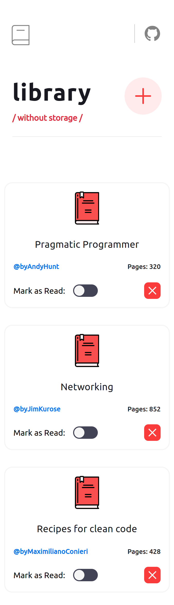
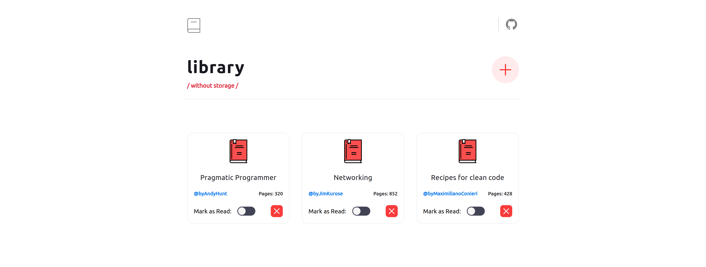

# Library
Library project is an online library management system designed to help users organize and track the books they are currently reading or plan to read in the future. Users can create and manage a personal book collection, categorize their books, and track their reading progress.

## Table of concepts
- [Overview](#overview)
  - [Screenshot](#screenshot)
  - [Links](#links)
- [Built with](#built-with)
- [Author](#author)

## Overview

### Screenshot

    - Mobile

  - Desktop

### Links
  - Live preview - [Library](https://emrahiso.github.io/Admin-dashboard/)
  - GitHub repo - [Library Repo](https://github.com/EmrahIso/Library.git)

## Built with 
  - HTML
  - CSS
  - FlexBox
  
## Author

- GitHub - [@EmrahIso](https://github.com/EmrahIso)